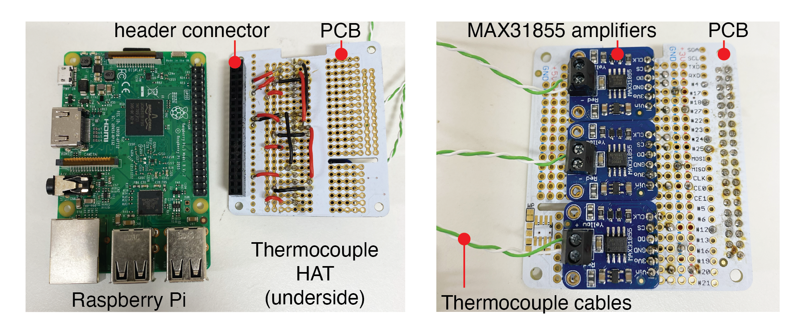
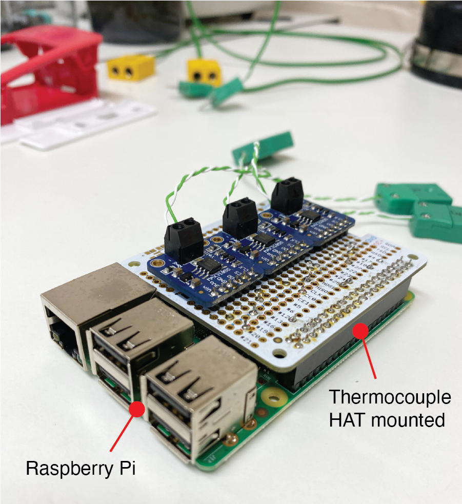
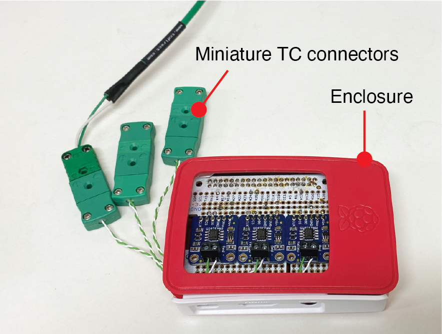

# Build Instructions and Notes

### Operating Principles

Thermocouples measure temperature at a junction between two dissimilar metals/conductors using the [Seebeck effect](https://en.wikipedia.org/wiki/Thermocouple). In thermocouple acquisition systems, there are two main requirements. Firstly, the voltage generated by the hot junction temperature of the thermocouple is low and requires amplification. Secondly, this voltage does not provide a reading of temperature by itself. Absolute temperature measurements at the hot junction are obtained using a reference sensor that measures a known temperature. This is known as cold junction compensation. In this build, we use the MAX31855 amplifier which includes cold junction compensation. This is designed for Type-K thermocouples and -200°C to +1350°C output in 0.25°C increments. We connect multiple amplifiers to a prototype HAT (Hardware Attached on Top) that can mount directly onto the header of a Raspberry Pi single board computer. This is then used to communicate with the hardware through the GPIO, record the measurements, and display the temperatures in real-time on a computer screen.


## Bill of Materials

|Name               |QTY|Description                           |
|:------------------|:-:|:-------------------------------------|
|[Raspberry Pi](https://uk.farnell.com/raspberry-pi/rpi3-modbp/sbc-board-raspberry-pi-3-model/dp/2842228?src=raspberrypi)|1  |Raspberry Pi 3B+ single board computer. |
|[PCB HAT](https://www.adafruit.com/product/2310)|1  |Adafruit Perma-Proto HAT without EEPROM.|
|[Raspberry Pi Case](https://uk.rs-online.com/web/p/raspberry-pi-cases/9098132)|1 |Case for RPi and thermocouple HAT.| 
|[Thermocouple Amplifier](https://www.adafruit.com/product/269)|3  |MAX31855 thermocouple amplifier board for Type-K thermocouples.|
|[Thermocouple connectors](https://uk.rs-online.com/web/p/sensor-accessories/8919031)|3  |For quick connection of thermocouples to datalogger.|
|[Thermocouple cable](https://uk.rs-online.com/web/p/thermocouple-extension-wire/2363959)|1  |Length depending on requirements.|
|Thermocouples|3  |Type-K thermocouples to suit the application.|
|Misc.|   | <ul><li>Wiring</li><li>Soldering Iron and solder</li><li>Small screwdriver</li></ul>|


## Wiring

### Thermocouple amplifier to PCB HAT

A schematic of the connections between the MAX31855 amplifier pins (3) and the Raspberry PI GPIO pins is shown below. The thermocouple HAT has been designed to operate using software SPI.


The thermocouple amplifiers, wiring connections, and RPi header connection were soldered to the prototype PCB, creating a thermocouple HAT for three Type K thermocouples.



### Thermocouple HAT to RPi and Thermocouple connectors

The thermocouple HAT is then connected directly to the RPi GPIO header.



A standard enclosure was used to house the RPi and thermocouple HAT. Thermocouple cables were connected to the amplifier pins and routed outside of the enclosure a short distance (~100 mm). Miniature Type K connectors were mounted at the ends of these cables to facilitate quick connect and disconnect actions for the thermocouples.  




## Python Codes

Two codes are executed from the Linux terminal of the Raspberry Pi. `temperatureLog.py` records the temperatures from the thermocouples and writes the data to a text file. `liveSubPlot.py` reads this text file and plots the temperatures to the computer display screen for real-time monitoring. 

### Temperature acquisition
The python code for aquiring temperature measurements from the thermocouples is located in `/Code/temperatureLog.py`. 

First, we include the necessary libraries for the SPI communication, MAX31855 amplifier and time.

```
import time
from datetime import datetime
import Adafruit_GPIO.SPI as SPI
import Adafruit_MAX31855.MAX31855 as MAX31855
```

The CLK, DO, CS pins for each thermocouple amplifier have been connected to the RPi GPIO pins as described in the wiring schematic above and for a software SPI configuration. The next part of the script defines the three sensors according to these GPIO connections.

```
CLK = 25
CS1  = 4
DO  = 18

CS2 = 24
CS3 = 12

sensor1 = MAX31855.MAX31855(CLK, CS1, DO)
sensor2 = MAX31855.MAX31855(CLK, CS2, DO)
sensor3 = MAX31855.MAX31855(CLK, CS3, DO)
```

The remainder of the code is contained within a `while` loop. In the first part of this loop, the hot junction and internal MAX31855 temperatures for each thermocouple are acquired. The time `t` is also recorded using `datetime` to allow us to correlate temperature observations with time. 

```
    T1 = sensor1.readTempC()
    T1_internal = sensor1.readInternalC()
    T2 = sensor2.readTempC()
    T2_internal = sensor2.readInternalC()
    T3 = sensor3.readTempC()
    T3_internal = sensor3.readInternalC()

    t = datetime.now().strftime('%H:%M:%S.%f')
```

The temperatures are written to a text file that can be analysed at a later time. Here, this text file is called `TemperatureData.txt` and is located in the same directory as the python code. The text file is opened and the time and temperature data recorded above are organised and appended to this file. After one second `time.sleep(1)`, the file is closed and the next set of measurements are taken.

```
    fh = open("TemperatureData.txt", 'a+')
    data = "{} {} {} {} {} {} {}\n".format(t, T1, T2, T3, T1_internal, T2_internal, T3_internal)
    fh.write(data)
    time.sleep(1)
    fh.close
```

### Live plot of temperatures
The python code for plotting the temperature measurements from the thermocouples in real-time is located in `/Code/liveSubPlot.py`.


We first add the libraries for plotting using matplotlib.

```
import matplotlib.pyplot as plt
from matplotlib.animation import FuncAnimation
import matplotlib.dates as mdates
from matplotlib import style
from datetime import datetime
```

The figure dimensions and four subplots are set up to display the three thermocouple measurements as well as the internal temperatures for each MAX31855 thermocouple amplifier.

```
fig = plt.figure(figsize = (12,12), edgecolor='k')
ax1 = fig.add_subplot(2,2,1)
ax2 = fig.add_subplot(2,2,2)
ax3 = fig.add_subplot(2,2,3)
ax4 = fig.add_subplot(2,2,4)
```

The remainder of the code populates the figure with the temperature and time data that has been recorded to the `TemperatureData.txt` file. Firstly, the text file is opened and the data is split out.  

```
    graph_tempdata = open('TemperatureData.txt','r').read()
    lines_t = graph_tempdata.split('\n')
```
Seven variables are preallocated for populating with the split data (time, T1, T2, T3, and internal temperatures).
```
    xt = []
    y0t = []
    y1t = []
    y2t = []
    y3t = []
    y4t = []
    y5t = []
```
And the data is appended to these variables within the `for` loop. This data is expressed as `float` for plotting to the figure window.
```
    for line in lines_t:
        if len(line) > 1:
            tb, T1, T2, T3, T1_int, T2_int, T3_int = line.split(' ')
            timestringb = datetime.strptime(tb,'%H:%M:%S.%f')
            xt.append(timestringb)
            y0t.append(float(T1))
            y1t.append(float(T1_int))
            y2t.append(float(T2))
            y3t.append(float(T2_int))
            y4t.append(float(T3))
            y5t.append(float(T3_int))
```
The plotting of the data for each variable, as well as the figure formatting, is carried out for each individual subplot in the figure window. For example, for the subplot showing `T1` data:
 ```
    ax1.clear()   
    ax1.xaxis.set_major_formatter(mdates.DateFormatter('%H:%M'))
    ax1.plot(xt, y0t, 'go-', linewidth = 0.5)
    ax1.set_title("$\mathbf{T1}$")
    ax1.set_ylabel('Temperature ($\mathbf{^{o}C}$)', fontweight='bold', fontsize = 9)
    ax1.grid(True)
```

Finally, the figure is animated and refreshed with the temperature and time data in the text file every 3 seconds (`interval=3000`). When considering the text file is being appended with data every one second when the `temperatureLog.py` is executed, the time interval in the `liveSubPlot.py` script simply defines how frequently the figure will update and has no influence on the temporal resolution of the recordings. 

```
ani = FuncAnimation(fig, animate, interval=3000)
plt.show()
```


