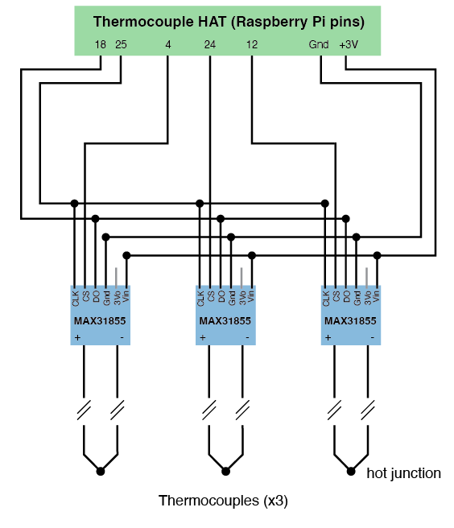

# Build Instructions and Notes

### Operating Principles

The core components in the build are the relay and microcontroller. The relay on the control board is an electromagnetic switch. Sending 5VDC to the relay energises the internal coil, mechanically switching its state from Normally-Open (NO) to a closed circuit $^*$. This process is automated using a programmable microcontroller which sends a 5VDC signal to the relay at specific times. All the circuitry has been placed within an enclosure to prevent access to the high AC voltages involved.

$^*$ _Note that the relay used in this build can also be wired for a Normally-Closed state if required (with lower current limits of 10A)._ 


## Bill of Materials

|Name               |QTY|Description                           |
|:------------------|:-:|:-------------------------------------|
|[DIN enclosure](https://uk.rs-online.com/web/p/cases-for-arduino/8607599)|1  |DIN enclosure for Arduino UNO with transparent window. |
|[Arduino](https://uk.rs-online.com/web/p/arduino/7154081)|1  |Arduino UNO microcontroller|
|[Relay Control Kit](https://www.sparkfun.com/products/13815)|1  |Beefcake relay control kit for high current AC switching.|
|[Axial fan](https://uk.farnell.com/sunon/mc30060v2-0000-a99/fan-30x30x6-9mm-5vdc/dp/1924848)|1  |For actively cooling the electronics inside the enclosure.|
|3-core cable|1  |Length depending on requirements for the relay switch. 1.5 mm$^2$ copper cores, or selected based on current requirements.|
|3-pin plug|1  |For connecting to mains AC supply.|
|3-pin socket|1 |For receiving the 3-pin plug of the device that will be controlled.|
|Jumper wire cables|3  |100-200mm length. For connecting Arduino pins to relay pcb.|
|M4 Screws|4  |10 mm long, for mounting fan to enclosure.|
|M3 standoffs and screws|2  |10 mm long, for mounting the relay pcb above the Arduino UNO.|
|Misc.|   | <ul><li>Wiring and heat shrink</li><li>Soldering Iron and solder</li><li>Glue</li><li>Electrical hand drill and drill bits</li><li>Masking tape</li></ul>|


## Wiring

### Thermocouple Amplifier to PCB HAT

To be added.



### Thermocouple connectors

To be added


## Python Codes

In progress. To be added.

The arduino code for uploading to the Arduino UNO microcontroller is located in `/Code/relay-switch.ino`. This contains a routine which turns the relay from the default open circuit (Normally-Open) to closed circuit where the outlet plug will be energised with AC from the source (in our case, single-phase 240VAC).

First, the signal pin is set as an output. Here, we use `LED_BUILTIN` as the signal pin which is pin 13 on the Arduino UNO.

```
void setup() {
  pinMode(LED_BUILTIN, OUTPUT);
}
```

The remainder of the code involves setting up the time intervals and switching duration. These define how long the relay will switch `on` and `off` for (in milliseconds). And the switching duration is expressed by a total ON time `t` which is limited in the for loop to be less than a user-defined value (e.g., `t<1800000`). The relay is actuated by sending pin 13 `HIGH` (5VDC) and returned to NO by sending pin 13 `LOW`. In this example, the AC circuit is energised for 1 minute, turns off for 2 minutes, and will operate for a total ON time of 30 minutes. Once this target duration of 30 mins is reached, the loop exits and the relay returns to the default NO state permanently.   

```
void loop() {
  long on=60000;      
  long off=120000;    

  for (long t=0; t<1800000; t=t+on) {    
    digitalWrite(LED_BUILTIN, HIGH);    
    delay(on);                          
    digitalWrite(LED_BUILTIN, LOW);     
    delay(off);                         
    Serial.println(""); 
   }
  
  exit(0); 
```


