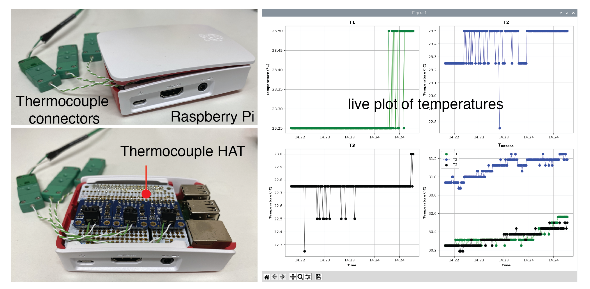

# Thermocouple-Datalogger

 _A RPi-controlled datalogger for measuring temperature using Type-K thermocouples, logging the temperature data to a file, and live-plotting the measured temperatures on the computer screen. Included are the build notes. Part of the Open Science Framework repository [Open2DM](https://osf.io/evupy/)_
 

### Background \& Motivation

_This is part of the [Open2DM](https://osf.io/evupy/) labware project._

Our research group study mechanochemical processes that produce two-dimensional materials in liquid dispersions (e.g., Graphene, MoS2, h-BN, etc.). These processes generate high shear conditions for exfoliating 2D materials and dispersing them in liquids. Depending on the process, the high shear environments can generate heat through viscous heating of the mixture. To quantify this viscous heating effect, and create temperature control strategies, it is necessary to measure temperature at different locations in the process. 

This repository provides the build details and code for creating a low-cost thermocouple datalogger for measuring temperatures over time.

Although this was our motivation, it is worth highlighting that this thermocouple datalogger can be used to measure temperature in numerous applications.     

### Disclaimer!

Thermocouples have a measurement uncertainty that can typically range $\pm 2$ degrees C, depending on the manufacturer specification. Therefore, it is not guaranteed that the temperature measurements from this device will have an accuracy greater than this without performing a calibration beforehand.  
